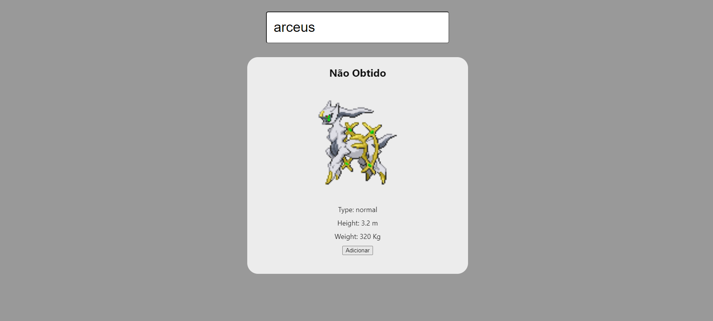

<h1>Web Service</h1>
<blockquote>Status do Projeto: Em desenvolvimento :warning: </blockquote>
Realizado durante a disciplina de Sistemas distribuidos. 
O projeto acessa a PokeAPI, para encontrar o pokemon pesquisado,  
e você pode adicionar ele, em cima do pokemon tem o status atual.

<h1>Frontend </h1>
O frontend inclui um campo para pesquisa, exibe os dados da pesquisa, e inclui um 
botão para adicionar o pokemon a tabela.

<h1>Backend </h1>
Usando Node, Express, e TypeORM, para criar a tabela, e usando SQLite para simulação do backend, 
para esse trabalho criei duas rotas:  
<strong>GET http://localhost:3333/poke </strong>

    Request:{
	    "id": ID Pokemon
    }  
    Response: Status do pokemon(Já Obtido ou Não Obtido)

 
<strong> POST http://localhost:3333/poke </strong>

    Request: {                  
        "name": Nome Pokemon,   
        "id": ID Pokemon
    }
    Response:  Cria o registro no BD, ou retorna um erro "Pokemon already exists"

<h1>Execução</h1>
Caso todas as dependecias estejam devidamente instaladas, basta rodar o comando:  
Para executar o backend (dentro da pasta backend):
<blockquote>	yarn dev   </blockquote>

Para executar o frontend (dentro da pasta frontend):
<blockquote>    ng serve  </blockquote>

Caso queira já abrir no navegador:
<blockquote>    ng serve --open </blockquote>

 

<h1>Finalizações</h1>
O insomnia envia respostas diferentes com a mesma requisição do sistema, 
estou tentando consertar esse bug atualmente. além disso faltam os teste.
Estou com algumas outras tarefas atrasadas, então estou momentaneamente 
deixando essa de lado.
